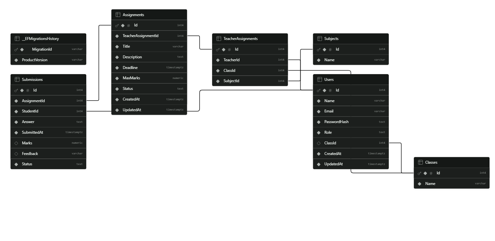

# Assignment & Submission Management System

A role-based full-stack web application for managing assignments and student submissions in a school or college environment.

The system provides separate workflows for **Admin, Teacher, and Student** users. It includes JWT-based authentication, role-based authorization, assignment management, student submissions, grading, feedback, PostgreSQL persistence, automated testing, Swagger/OpenAPI documentation, responsive frontend interfaces, and deployment configuration.

---

## Table of Contents

- [Project Overview](#project-overview)
- [Requirement Coverage](#requirement-coverage)
- [Live Application](#live-application)
- [User Roles](#user-roles)
- [Core Workflow](#core-workflow)
- [Main Features](#main-features)
- [Technology Stack](#technology-stack)
- [System Architecture](#system-architecture)
- [Project Structure](#project-structure)
- [Authentication and Authorization](#authentication-and-authorization)
- [Database](#database)
- [Database Schema](#database-schema)
- [Environment Configuration](#environment-configuration)
- [Production Database Credentials](#production-database-credentials)
- [Demo Credentials](#demo-credentials)
- [Local Development Setup](#local-development-setup)
- [Running the Tests](#running-the-tests)
- [Swagger / OpenAPI](#swagger--openapi)
- [Docker Setup](#docker-setup)
- [API Overview](#api-overview)
- [Assignment Workflow](#assignment-workflow)
- [Submission Workflow](#submission-workflow)
- [Important Business Rules](#important-business-rules)
- [Validation and Error Handling](#validation-and-error-handling)
- [Database Migrations and Seeding](#database-migrations-and-seeding)
- [Testing Strategy](#testing-strategy)
- [Deployment](#deployment)
- [Assumptions and Design Decisions](#assumptions-and-design-decisions)
- [Known Limitations](#known-limitations)
- [Optional Additions](#optional-additions)
- [Future Improvements](#future-improvements)
- [Evaluation Quick Start](#evaluation-quick-start)
- [Submission Checklist](#submission-checklist)

---

# Project Overview

The **Assignment & Submission Management System** is a role-based school/college application developed to manage the assignment lifecycle from assignment creation through student submission and teacher evaluation.

The application supports three primary roles:

- **Admin**
- **Teacher**
- **Student**

The main academic workflow is:

```text
Admin
  |
  +---- Manage Users
  |
  +---- Manage Classes
  |
  +---- Manage Subjects
  |
  +---- Assign Teachers to Classes/Subjects
  |
  v
Teacher
  |
  +---- Create Assignment
  |
  +---- Save as Draft
  |
  +---- Publish Assignment
  |
  +---- View Student Submissions
  |
  +---- Grade Submissions
  |
  +---- Provide Feedback
  |
  v
Student
  |
  +---- View Assigned Assignments
  |
  +---- View Assignment Details
  |
  +---- Submit Answer
  |
  +---- Track Submission Status
  |
  +---- View Marks and Feedback
```

The backend API is the authoritative layer for:

- Authentication
- Authorization
- Validation
- Assignment ownership
- Submission access
- Grading rules
- Other important business rules

---

# Requirement Coverage

The project was developed according to the supplied **Assistant Software Engineer Recruitment Project — Assignment & Submission Management System** requirements.

| Requirement | Status |
|---|---|
| Full-stack web application | Implemented |
| Next.js | Implemented |
| React | Implemented |
| TypeScript | Implemented |
| Responsive UI | Implemented |
| Form validation | Implemented |
| API integration | Implemented |
| ASP.NET Core Web API | Implemented |
| C# | Implemented |
| RESTful API | Implemented |
| Validation | Implemented |
| Error handling | Implemented |
| Logging | Implemented |
| Swagger/OpenAPI | Implemented |
| PostgreSQL | Implemented |
| Required relational relationships | Implemented |
| Login | Implemented |
| JWT-based authentication | Implemented |
| Role-based authorization | Implemented |
| Unit tests | Implemented |
| Authorization tests | Implemented |
| Submission workflow tests | Implemented |
| Database migrations | Included |
| Seed/sample data | Included |
| Database setup artifacts | Included |
| `.env.example` | Included |
| Demo credentials | Included |
| Frontend deployment | Implemented |
| Backend deployment | Implemented |
| Docker configuration | Included as an optional addition |

The application also implements backend resource-level authorization and business-rule validation in addition to basic role-based authorization.

---

# Live Application

## Frontend

The frontend is deployed using **Netlify**.

**Live URL:**

https://assignementmanagement.netlify.app

---

## Backend API

The backend is deployed using **Render**.

**Backend URL:**

https://assignment-management-kadi.onrender.com

The backend exposes the REST API used by the frontend.

---

## Database

The deployed backend uses **PostgreSQL hosted through Supabase**.

The production database credentials are stored privately in the backend deployment environment and are not included in the repository.

The deployed architecture is:

```text
Browser
   |
   v
Netlify Frontend
   |
   v
Render ASP.NET Core Backend
   |
   v
Supabase PostgreSQL
```

---

# User Roles

## Admin

The Admin is responsible for managing the academic structure of the application.

### Admin capabilities

- Manage users
- Manage classes
- Manage subjects
- Assign teachers to classes and subjects
- View assignments
- View submissions
- Manage the academic structure of the application

The requirement mentions application-level settings where necessary. Since no specific application-level settings were defined in the assignment, a separate settings-management module was not introduced.

---

## Teacher

Teachers are responsible for creating assignments and evaluating student submissions.

### Teacher capabilities

- View assigned classes
- View assigned subjects
- Create assignments
- Update assignments
- Delete assignments where permitted
- Save assignments as drafts
- Publish assignments
- Define assignment title
- Define assignment description
- Define deadline
- Define maximum marks
- Select a class
- Select a subject
- View student submissions
- Review submissions
- Assign marks
- Provide feedback
- Change submission status where permitted

---

## Student

Students can view and submit assignments assigned to their class.

### Student capabilities

- View assignments assigned to their class
- View assignment details
- View deadlines
- Submit answers
- Update a submission before the deadline where allowed
- View submission status
- View marks
- View teacher feedback

---

# Core Workflow

```text
                         ADMIN
                           |
        +------------------+------------------+
        |                  |                  |
        v                  v                  v
      Users             Classes           Subjects
                           |
                           v
                  Teacher Assignments
                           |
                           v
                        TEACHER
                           |
             +-------------+-------------+
             |             |             |
             v             v             v
          Create        Publish        Review
         Assignment     Assignment    Submissions
             |             |             |
             +-------------+-------------+
                           |
                           v
                        STUDENT
                           |
                           v
                    View Assignment
                           |
                           v
                     Submit Answer
                           |
                           v
                        TEACHER
                           |
                    Marks + Feedback
                           |
                           v
                        STUDENT
```

---

# Main Features

## Authentication

- Login
- JWT-based authentication
- Password-based authentication
- JWT signature validation
- JWT issuer validation
- JWT audience validation
- JWT expiration validation
- Protected API endpoints
- Authenticated frontend workflow

---

## Role-Based Authorization

The application supports:

```text
Admin
Teacher
Student
```

Authorization is enforced by the backend.

Frontend role checks are used for navigation and user experience, while the backend independently verifies access to protected resources.

---

## Admin Management

The Admin workflow includes:

- User management
- Class management
- Subject management
- Teacher/class/subject assignment management
- Viewing academic data

---

## Assignment Management

Teachers can:

- Create assignments
- Update assignments
- Delete assignments where permitted
- Save assignments as drafts
- Publish assignments
- Set assignment deadlines
- Set maximum marks
- Associate assignments with classes
- Associate assignments with subjects

---

## Submission Management

Students can:

- View eligible assignments
- View assignment details
- Submit answers
- Update submissions before the applicable deadline

Teachers can:

- View submissions
- Review submissions
- Assign marks
- Provide feedback
- Change submission status where permitted

---

## Validation

The backend validates important application rules, including:

- Required request data
- Assignment ownership
- Teacher authorization
- Student assignment access
- Submission access
- Mark limits
- Negative marks

---

# Technology Stack

## Frontend

- Next.js 16
- React
- TypeScript
- Tailwind CSS
- Responsive UI
- Form validation
- REST API integration

---

## Backend

- ASP.NET Core 8 Web API
- C#
- Entity Framework Core
- RESTful API
- JWT Authentication
- Role-Based Authorization
- DTO-based API design
- Validation
- Error handling
- Exception middleware
- Logging
- Swagger/OpenAPI

---

## Database

- PostgreSQL
- Supabase PostgreSQL
- Entity Framework Core
- EF Core migrations
- Foreign-key relationships
- Relational data model
- Database seeding

---

## Testing

- xUnit
- FluentAssertions
- Entity Framework Core InMemory provider
- ASP.NET Core integration testing
- WebApplicationFactory
- Controller tests
- Service tests
- Authorization tests
- Submission workflow tests

---

## Deployment

- Netlify — Frontend
- Render — Backend
- Supabase — PostgreSQL

---

# System Architecture

```text
+-----------------------------+
|       Next.js Frontend      |
|       React + TypeScript    |
+--------------+--------------+
               |
               | REST API
               | JWT
               v
+-----------------------------+
|     ASP.NET Core Web API    |
|                             |
| Controllers                 |
| Services                    |
| DTOs                        |
| Middleware                  |
| Authentication              |
| Authorization               |
| Validation                  |
| Logging                     |
+--------------+--------------+
               |
               | Entity Framework Core
               v
+-----------------------------+
|      PostgreSQL Database    |
|          Supabase           |
+-----------------------------+
```

---

# Project Structure

```text
AssignmentManagement/
│
├── AssignmentManagement.Api/
│   │
│   ├── Configuration/
│   │
│   ├── Controllers/
│   │   ├── AdminController.cs
│   │   ├── AssignmentsController.cs
│   │   ├── AuthController.cs
│   │   ├── ClassesController.cs
│   │   ├── StudentAssignmentsController.cs
│   │   ├── SubjectsController.cs
│   │   ├── SubmissionsController.cs
│   │   ├── TeacherAssignmentsController.cs
│   │   ├── TeacherSubmissionsController.cs
│   │   ├── TestController.cs
│   │   └── UsersController.cs
│   │
│   ├── Data/
│   │   ├── AppDbContext.cs
│   │   └── DbSeeder.cs
│   │
│   ├── DTOs/
│   ├── Middleware/
│   ├── Migrations/
│   ├── Models/
│   ├── Services/
│   │
│   ├── Dockerfile
│   ├── Program.cs
│   ├── appsettings.json
│   └── .dockerignore
│
├── AssignmentManagement.Tests/
│   │
│   ├── Auth/
│   │   └── AuthServiceTests.cs
│   │
│   ├── Controllers/
│   │   ├── AdminControllerTests.cs
│   │   ├── AssignmentControllerTests.cs
│   │   ├── ClassesControllerTests.cs
│   │   ├── StudentAssignmentsControllerTests.cs
│   │   ├── SubjectsControllerTests.cs
│   │   ├── SubmissionControllerTests.cs
│   │   ├── TeacherAssignmentsControllerTests.cs
│   │   ├── TeacherSubmissionControllerTests.cs
│   │   ├── TestControllerTests.cs
│   │   └── UsersControllerTests.cs
│   │
│   ├── Helpers/
│   │   ├── TestClaimsPrincipal.cs
│   │   └── TestDbContextFactory.cs
│   │
│   ├── Integration/
│   │   └── AuthorizationTests.cs
│   │
│   ├── Unit/
│   ├── AssignmentServiceTests.cs
│   ├── SubmissionServiceTests.cs
│   ├── appsettings.Testing.json
│   └── AssignmentManagement.Tests.csproj
│
├── frontend/
│   │
│   ├── public/
│   ├── src/
│   ├── package.json
│   ├── package-lock.json
│   ├── next.config.ts
│   ├── Dockerfile
│   ├── .dockerignore
│   ├── netlify.toml
│   └── .env.example
│
├── docs/
│   └── database-schema.png
│
├── .env.example
├── .gitignore
├── AssignmentManagement.sln
├── docker-compose.yml
└── README.md
```

---

# Authentication and Authorization

The application uses JWT-based authentication.

The available roles are:

```text
Admin
Teacher
Student
```

After successful login, the backend issues a JWT containing the authenticated user's identity and role information.

The API validates:

- Token signature
- Signing key
- Issuer
- Audience
- Token lifetime
- Expiration

---

## Backend Authorization

The backend acts as the security boundary.

The authorization flow can be represented as:

```text
Authenticated Request
        |
        v
     JWT Valid?
        |
        v
      User
        |
        v
      Role
        |
        v
 Resource Permission
        |
        v
 Business Rules
        |
        v
 Allow / Deny
```

A frontend restriction alone is not considered sufficient authorization.

The backend independently verifies access to protected resources.

---

# No Public Signup

Public signup is intentionally not implemented.

The system assumes that user accounts are controlled by the institution rather than created by unknown visitors.

The intended account-management model is:

```text
School Administrator
        |
        +---- Create Teacher
        |
        +---- Create Student
        |
        +---- Assign Role
```

This prevents unrestricted creation of privileged accounts such as Admin.

The current implementation uses controlled/seeded accounts for evaluation.

---

# Database

The application uses **PostgreSQL**.

The deployed database is hosted through **Supabase**.

Entity Framework Core is responsible for:

- Database access
- Entity relationships
- Queries
- Persistence
- Migrations
- Schema management

---

# Database Schema

The application uses a relational data model because the academic domain contains clear relationships among:

- Users
- Classes
- Subjects
- Teacher assignments
- Assignments
- Submissions

The database migration files are located at:

```text
AssignmentManagement.Api/Migrations/
```

The database seeding logic is located at:

```text
AssignmentManagement.Api/Data/DbSeeder.cs
```

---

## Database Schema Diagram

The repository includes the PostgreSQL database schema diagram below.



The diagram provides a visual representation of the database tables and their relationships.

---

## High-Level Database Relationships

```text
User
 |
 +----------------------+
 |                      |
 v                      v
Student                Teacher
 |                      |
 |                      v
 |              TeacherAssignment
 |                      |
 |                +-----+-----+
 |                |           |
 |                v           v
 |              Class       Subject
 |                            |
 |                            v
 +----------------------> Assignment
                              |
                              v
                          Submission
```

---

# Environment Configuration

Environment variables are used for environment-specific configuration and sensitive values.

The repository includes example configuration files:

```text
.env.example
frontend/.env.example
```

These files contain placeholders rather than production secrets.

---

# Backend Environment Variables

A local backend configuration requires a PostgreSQL connection string and JWT configuration.

Example:

```env
ConnectionStrings__DefaultConnection=Host=localhost;Port=5432;Database=assignment_management;Username=postgres;Password=<YOUR_LOCAL_POSTGRES_PASSWORD>

Jwt__Key=<YOUR_LONG_RANDOM_JWT_SECRET>
Jwt__Issuer=AssignmentManagement.Api
Jwt__Audience=AssignmentManagement.Client
Jwt__ExpirationMinutes=60
```

The actual values depend on the local development environment.

---

# Frontend Environment Variables

The frontend requires the backend API URL.

For local development:

```env
NEXT_PUBLIC_API_URL=http://localhost:5286/api
```

The deployed frontend uses the deployed backend API URL.

The frontend does not require or receive the PostgreSQL database password.

---

# Production Database Credentials

The production application uses the following architecture:

```text
Browser
   |
   v
Netlify Frontend
   |
   v
Render ASP.NET Core Backend
   |
   v
Supabase PostgreSQL
```

The **production PostgreSQL password is intentionally not included in this repository**.

This is a security requirement because real passwords, API keys, JWT secrets, and other sensitive credentials should not be committed to source control.

The production database credentials are configured privately in the backend deployment environment.

---

## Evaluation of the Deployed Application

An evaluator who wants to test the deployed application **does not need the production database password**.

The evaluator can:

1. Open the deployed frontend.
2. Log in using one of the provided demo accounts.
3. Test the Admin workflow.
4. Test the Teacher workflow.
5. Test the Student workflow.

The deployed frontend communicates with the deployed backend, and the deployed backend communicates with Supabase PostgreSQL using its private production configuration.

```text
Evaluator Browser
       |
       v
Netlify Frontend
       |
       v
Render Backend
       |
       | Private database credentials
       v
Supabase PostgreSQL
```

The database password is therefore never required in the frontend and is not exposed to the evaluator.

---

## Local Development

For local development, the production Supabase password is also not required.

A developer/evaluator can create a local PostgreSQL database and use their own credentials.

Example:

```env
ConnectionStrings__DefaultConnection=Host=localhost;Port=5432;Database=assignment_management;Username=postgres;Password=<YOUR_LOCAL_POSTGRES_PASSWORD>
```

The local frontend communicates with the local backend using:

```env
NEXT_PUBLIC_API_URL=http://localhost:5286/api
```

Therefore:

```text
Local Frontend
      |
      v
Local Backend
      |
      v
Local PostgreSQL
```

is completely independent of the production database credentials.

---

## Environment Security

Production credentials should be supplied through the deployment platform's environment configuration.

The following should not contain real production credentials:

```text
.env.example
frontend/.env.example
README.md
Source-controlled configuration files
```

The repository should contain placeholders only.

---

# Demo Credentials

The application contains seeded demonstration accounts for evaluation.

## Admin

```text
Email: admin@example.com
Password: Admin@12345
```

## Teacher

```text
Email: teacher@example.com
Password: Teacher@12345
```

## Student

```text
Email: student@example.com
Password: Student@12345
```

These are demonstration/evaluation accounts seeded by the application.

They are not intended to represent production credentials.

---

# Database Migrations and Seeding

The project includes Entity Framework Core migrations.

Migration files are located at:

```text
AssignmentManagement.Api/Migrations/
```

The database seeder is located at:

```text
AssignmentManagement.Api/Data/DbSeeder.cs
```

The application startup process applies pending migrations and initializes the required demonstration data.

The startup flow is:

```text
Application Starts
       |
       v
Database Connection
       |
       v
Apply Pending EF Core Migrations
       |
       v
Run Database Seeder
       |
       v
Create Missing Demo Data
       |
       v
Start API
```

This allows the database schema to be created from the repository's migration history without manually creating individual tables.

---

# Seeded Demo Data

The seeded environment contains demonstration data including:

- Class 10
- Mathematics
- Physics
- Admin account
- Teacher account
- Student account
- Teacher-to-class/subject assignment
- Sample published assignment

Example assignment:

```text
Title:
Algebra Basics

Description:
Solve the basic algebra problems.

Status:
Published

Maximum Marks:
100
```

---

# Local Development Setup

## Prerequisites

### Required

- Git
- .NET 8 SDK
- Node.js
- npm
- PostgreSQL

### Optional

- Docker Desktop
- Visual Studio Code
- Postman or another API client

---

# Step 1 — Clone the Repository

```bash
git clone <YOUR_GITHUB_REPOSITORY_URL>
cd AssignmentManagement
```

---

# Step 2 — Configure PostgreSQL

Make sure PostgreSQL is running.

Create a local database named:

```text
assignment_management
```

Example local configuration:

```text
Host=localhost
Port=5432
Database=assignment_management
Username=postgres
Password=<YOUR_LOCAL_POSTGRES_PASSWORD>
```

The local PostgreSQL password is environment-specific.

The production Supabase password is not required for local development.

---

# Step 3 — Configure the Backend

Configure the backend environment using the required PostgreSQL and JWT settings.

Example:

```env
ConnectionStrings__DefaultConnection=Host=localhost;Port=5432;Database=assignment_management;Username=postgres;Password=<YOUR_LOCAL_POSTGRES_PASSWORD>

Jwt__Key=<YOUR_LONG_RANDOM_JWT_SECRET>
Jwt__Issuer=AssignmentManagement.Api
Jwt__Audience=AssignmentManagement.Client
Jwt__ExpirationMinutes=60
```

---

# Step 4 — Restore Backend Dependencies

From the repository root:

```bash
cd AssignmentManagement.Api
dotnet restore
```

---

# Step 5 — Build the Backend

```bash
dotnet build
```

---

# Step 6 — Run the Backend

The current local frontend configuration expects the backend to run on port `5286`.

Start the API using:

```bash
dotnet run --urls "http://localhost:5286"
```

The backend will be available at:

```text
http://localhost:5286
```

The API base URL is:

```text
http://localhost:5286/api
```

When the application starts, pending migrations and seed initialization are handled by the application's database initialization process.

---

# Step 7 — Configure the Frontend

Open a second terminal.

From the repository root:

```bash
cd frontend
```

Install dependencies:

```bash
npm install
```

Create:

```text
frontend/.env.local
```

Add:

```env
NEXT_PUBLIC_API_URL=http://localhost:5286/api
```

---

# Step 8 — Start the Frontend

Run:

```bash
npm run dev
```

The frontend will be available at:

```text
http://localhost:3000
```

---

# Complete Local Startup

## Terminal 1 — Backend

```bash
cd AssignmentManagement.Api
dotnet restore
dotnet build
dotnet run --urls "http://localhost:5286"
```

## Terminal 2 — Frontend

```bash
cd frontend
npm install
npm run dev
```

Then open:

```text
http://localhost:3000
```

---

# Local Login

Use one of the seeded demonstration accounts.

### Admin

```text
admin@example.com
Admin@12345
```

### Teacher

```text
teacher@example.com
Teacher@12345
```

### Student

```text
student@example.com
Student@12345
```

---

# Frontend Production Build

The frontend production build can be verified with:

```bash
cd frontend
npm run build
```

---

# Backend Production Build

The backend can be built in Release configuration using:

```bash
cd AssignmentManagement.Api
dotnet build --configuration Release
```

---

# Running the Tests

The project includes automated tests using xUnit and FluentAssertions.

From the repository root:

```bash
dotnet test
```

For a clean verification:

```bash
dotnet clean
dotnet build
dotnet test
```

---

# Test Structure

```text
AssignmentManagement.Tests/
│
├── Auth/
│   └── AuthServiceTests.cs
│
├── Controllers/
│   ├── AdminControllerTests.cs
│   ├── AssignmentControllerTests.cs
│   ├── ClassesControllerTests.cs
│   ├── StudentAssignmentsControllerTests.cs
│   ├── SubjectsControllerTests.cs
│   ├── SubmissionControllerTests.cs
│   ├── TeacherAssignmentsControllerTests.cs
│   ├── TeacherSubmissionControllerTests.cs
│   ├── TestControllerTests.cs
│   └── UsersControllerTests.cs
│
├── Helpers/
│   ├── TestClaimsPrincipal.cs
│   └── TestDbContextFactory.cs
│
├── Integration/
│   └── AuthorizationTests.cs
│
├── Unit/
│
├── AssignmentServiceTests.cs
├── SubmissionServiceTests.cs
├── appsettings.Testing.json
└── AssignmentManagement.Tests.csproj
```

---

# Testing Strategy

Testing focuses on important business rules, authorization, and submission workflows required by the assignment.

The test suite covers:

- Authentication
- Authorization
- Assignment management
- Assignment ownership
- Submission workflows
- Grading
- Validation
- Controller behavior
- Service behavior
- Role restrictions

---

# Assignment Tests

Examples include:

- Teacher can create an assignment.
- Teacher can create a draft assignment.
- Teacher cannot create an assignment outside the authorized teaching scope.
- Teacher cannot update another teacher's assignment.
- Assignment ownership is enforced.
- Published assignment restrictions are enforced.

---

# Submission Tests

Examples include:

- Teacher can review an authorized submission.
- Marks are stored correctly.
- Feedback is stored correctly.
- Marks cannot exceed maximum marks.
- Negative marks are rejected.
- Unauthorized teachers cannot review unrelated submissions.

---

# Authorization Tests

Integration tests verify role-based access control.

Examples include:

- Student cannot access Teacher-only endpoints.
- Teacher cannot access Student-only endpoints.
- Unauthorized users cannot access protected resources.
- Resource-level authorization is enforced where applicable.

---

# Testing Database

The test project includes:

```text
TestDbContextFactory.cs
```

Entity Framework Core's InMemory provider is used for suitable controller and service tests.

This keeps those tests independent of the production Supabase database.

Integration tests use the application's test configuration and authentication test infrastructure.

---

# Swagger / OpenAPI

The backend includes Swagger/OpenAPI documentation.

When running locally, Swagger UI is available at:

```text
http://localhost:5286/swagger
```

Swagger can be used to:

- Inspect API endpoints
- View request models
- View response models
- Test API endpoints
- Inspect authentication requirements

Protected endpoints require a valid JWT token.

---

# API Overview
The backend exposes a RESTful API for authentication, user management, academic configuration, assignments, submissions, and role-based access control.

All protected endpoints require a valid JWT access token unless otherwise stated.

The API is organized around the following resource areas:

```text
/api/auth
/api/users
/api/classes
/api/subjects
/api/assignments
/api/student-assignments
/api/teacher-assignments
/api/submissions
/api/teacher-submissions
```
For local development:

```text
http://localhost:5286/api
The complete endpoint behavior is available through Swagger/OpenAPI.
```

---

# Assignment Workflow

Assignments support a draft/published workflow.

```text
+-------------+
|    Draft    |
+------+------+
       |
       | Publish
       v
+-------------+
|  Published  |
+------+------+
       |
       | Student submits
       v
+-------------+
|  Submitted  |
+------+------+
       |
       | Teacher reviews
       v
+-------------+
|   Reviewed  |
+-------------+
```

---

# Draft Assignments

Teachers can prepare assignments as drafts before publishing them.

Draft assignments are not treated as ordinary published student assignments.

---

# Published Assignments

Once published:

- Eligible students can view the assignment.
- The assignment becomes available through the student workflow.
- Submission rules become applicable.
- The assignment follows the backend's published-assignment rules.

---

# Submission Workflow

```text
Published Assignment
        |
        v
Student Views Assignment
        |
        v
Student Submits Answer
        |
        v
Submission Stored
        |
        v
Teacher Reviews Submission
        |
        +---- Marks
        |
        +---- Feedback
        |
        +---- Status
        |
        v
Student Views Result
```

---

# Important Business Rules

## Assignment Ownership

A teacher can only manage assignments associated with their authorized teacher assignment.

A teacher cannot manage another teacher's assignment.

---

## Student Access

Students can only access assignments intended for their class.

---

## Teacher Submission Access

Teachers can only review submissions within their authorized teaching scope.

---

## Marks

Marks must satisfy:

```text
0 <= Marks <= MaximumMarks
```

Therefore:

```text
Negative marks
```

are invalid.

Marks greater than the assignment's maximum marks are also invalid.

---

## Assignment Status

Assignments support:

```text
Draft
Published
```

Published assignments follow different rules from draft assignments.

---

## Submission Rules

Submission operations are governed by the assignment deadline and the application's submission rules.

---

## Authentication

Protected endpoints require a valid JWT.

---

## Authorization

A valid login does not automatically provide access to every resource.

The backend checks the authenticated user's role and resource-level permissions.

---

# Validation and Error Handling

The backend includes centralized exception handling middleware.

The application contains:

```text
ExceptionMiddleware
```

The middleware provides centralized handling for unexpected application exceptions.

The API also provides validation responses for invalid requests.

This keeps API error responses consistent and prevents raw unhandled server-side exceptions from being exposed directly to clients.

---

# Logging

Backend logging is included as part of the ASP.NET Core application.

Logging supports troubleshooting and operational visibility during application execution.

---

# Database Migrations and Seeding

The repository includes:

```text
AssignmentManagement.Api/Migrations/
```

for Entity Framework Core migrations.

It also includes:

```text
AssignmentManagement.Api/Data/DbSeeder.cs
```

for initial demonstration data.

This satisfies the database setup requirements by providing migration history and seed/sample data in the repository.

The application can initialize the schema from the migration history rather than requiring manual table creation.

---

# Docker Setup

Docker configuration is included as an **optional addition** to the project.

The repository contains:

```text
docker-compose.yml
```

Backend Dockerfile:

```text
AssignmentManagement.Api/Dockerfile
```

Frontend Dockerfile:

```text
frontend/Dockerfile
```

The Docker configuration provides a containerized option for running the application components.

The standard local setup described earlier can also be used without Docker.

---

# Deployment

## Frontend

The frontend is deployed using Netlify.

```text
Next.js Frontend
       |
       v
    Netlify
```

Live URL:

```text
https://assignementmanagement.netlify.app
```

---

## Backend

The backend is deployed using Render.

```text
ASP.NET Core Web API
       |
       v
     Render
```

Live URL:

```text
https://assignment-management-kadi.onrender.com
```

---

## Database

The deployed backend uses PostgreSQL hosted through Supabase.

```text
Render Backend
      |
      v
Supabase PostgreSQL
```

---

# Deployment Environment Variables

Production environment variables are configured privately on the deployment platforms.

## Backend

The backend requires configuration equivalent to:

```text
ConnectionStrings__DefaultConnection
Jwt__Key
Jwt__Issuer
Jwt__Audience
Jwt__ExpirationMinutes
```

The actual production values are not committed to the repository.

---

## Frontend

The frontend requires:

```text
NEXT_PUBLIC_API_URL
```

For local development:

```env
NEXT_PUBLIC_API_URL=http://localhost:5286/api
```

For the deployed frontend, this variable points to the deployed backend API.

---

# Local vs Deployed Architecture

## Local Development

```text
Browser
   |
   v
Next.js
localhost:3000
   |
   v
ASP.NET Core API
localhost:5286
   |
   v
Local PostgreSQL
localhost:5432
```

Frontend environment:

```env
NEXT_PUBLIC_API_URL=http://localhost:5286/api
```

---

## Deployed Application

```text
Browser
   |
   v
Netlify Frontend
   |
   v
Render ASP.NET Core API
   |
   v
Supabase PostgreSQL
```

The production database credentials remain private inside the backend deployment environment.

---

# Assumptions and Design Decisions

The original requirements leave some implementation details open. The following assumptions and design decisions were made accordingly.

---

## Account Management

There is no public signup.

The system assumes that account creation is controlled by the institution.

---

## Application-Level Settings

The requirement allows Admins to manage application-level settings where necessary.

Since no specific application-level settings were defined by the assignment, a separate settings-management module was not introduced.

---

## School Structure

The current implementation represents a school/college environment.

Complete multi-school tenant isolation is not implemented.

---

## Teacher Assignment

Teacher access is determined by teacher-to-class/subject assignments.

---

## Student Assignment Visibility

Students receive assignments based on their associated class.

---

## Assignment Status

Assignments support:

```text
Draft
Published
```

The submission workflow additionally tracks submission/review states.

---

## Grading

Marks cannot be:

- Negative
- Greater than the assignment's maximum marks

---

## Database Choice

PostgreSQL was selected because the academic domain contains clear relational relationships among:

- Users
- Classes
- Subjects
- Teacher assignments
- Assignments
- Submissions

---

## Email

The core application does not use a real external email delivery provider.

---

## Notifications

Real-time or external notification infrastructure is not part of the current implementation.

---

# Known Limitations

The following are known limitations of the current implementation:

- No public signup.
- No production password reset email workflow.
- No real external email delivery.
- No complete multi-school tenant isolation.
- No production distributed cache such as Redis.
- No enterprise-level audit logging.
- No multi-factor authentication.
- No external notification service.
- No pagination.
- No advanced filtering.

These limitations do not prevent the required core assignment and submission workflow from functioning.

---

# Optional Additions

The recruitment requirements list several features as optional additions.

The implementation status is documented below.

## Implemented Optional Additions

### Live Project URL

Implemented.

Frontend:

```text
https://assignementmanagement.netlify.app
```

Backend:

```text
https://assignment-management-kadi.onrender.com
```

### Docker Configuration

Implemented.

The repository includes:

```text
docker-compose.yml
AssignmentManagement.Api/Dockerfile
frontend/Dockerfile
```

---

## Optional Additions Not Implemented

The following optional additions are not part of the current implementation:

### Pagination

Not implemented.

### Advanced Filtering

Not implemented.

### Notifications

Not implemented as an external or real-time notification system.

These features are listed as potential future improvements rather than being presented as completed functionality.

---

# Email and Notification Considerations

The current application does not depend on an external email provider.

Possible future email functionality could include:

- Teacher account creation emails
- Student account creation emails
- Temporary password delivery
- Password reset emails
- Assignment publication notifications
- Submission confirmation emails
- Grading notifications
- Feedback notifications
- Deadline reminders

A future notification architecture could support:

```text
Application Event
       |
       +---- In-App Notification
       |
       +---- Email Notification
       |
       +---- Push Notification
```

---

# Future Improvements

Potential future improvements include:

- Multi-school / multi-tenant architecture
- School-specific administrators
- Temporary password generation
- First-login password change
- Password reset
- Transactional email
- Email verification
- Refresh tokens
- Secure HTTP-only authentication cookies
- MFA / 2FA
- Redis distributed caching
- Pagination
- Advanced filtering
- Search
- Audit logs
- Activity history
- Real-time notifications
- Push notifications
- Rate limiting
- Account lockout
- Detailed reporting
- Student performance analytics
- Teacher dashboards

These are future enhancements and are not presented as completed features of the current submission.

---

# Evaluation Quick Start

The deployed application can be evaluated without configuring a local database.

## Step 1 — Open the Frontend

Open:

```text
https://assignementmanagement.netlify.app
```

---

## Step 2 — Login

Use one of the supplied demo accounts.

### Admin

```text
Email: admin@example.com
Password: Admin@12345
```

### Teacher

```text
Email: teacher@example.com
Password: Teacher@12345
```

### Student

```text
Email: student@example.com
Password: Student@12345
```

---

## Step 3 — Evaluate the Roles

### Admin

Evaluate:

- User management
- Class management
- Subject management
- Teacher assignments

### Teacher

Evaluate:

- Assignment creation
- Draft assignment
- Publishing
- Assignment management
- Submission review
- Marks
- Feedback

### Student

Evaluate:

- Assignment viewing
- Assignment details
- Submission
- Submission status
- Marks
- Feedback

---

# Local Evaluation

For local evaluation:

1. Clone the repository.
2. Install the required prerequisites.
3. Configure a local PostgreSQL database.
4. Configure the backend environment variables.
5. Run the backend.
6. Configure `frontend/.env.local`.
7. Run the frontend.
8. Login using the seeded demo accounts.
9. Run `dotnet test` to execute the automated test suite.

The production Supabase database password is not required for this process.

---

# Repository Security

Production credentials are intentionally excluded from source control.

The repository should contain:

```text
.env.example
frontend/.env.example
```

with placeholder values only.

Production credentials belong in the deployment environment.

Sensitive values include:

- Database passwords
- Supabase credentials
- JWT signing secrets
- API keys
- Private tokens
- Personal credentials

---

# Final Submission Checklist

The project submission includes the following required components:

- [x] Complete source code
- [x] Frontend
- [x] Backend/API
- [x] PostgreSQL database model
- [x] Required relational relationships
- [x] EF Core migration files
- [x] Seed/sample data
- [x] README
- [x] Demo credentials
- [x] `.env.example`
- [x] JWT authentication
- [x] Role-based authorization
- [x] RESTful API
- [x] Validation
- [x] Error handling
- [x] Logging
- [x] Swagger/OpenAPI
- [x] Unit tests
- [x] Authorization tests
- [x] Submission workflow tests
- [x] Frontend deployment
- [x] Backend deployment
- [x] PostgreSQL/Supabase database
- [x] Docker configuration as an optional addition

---

# Requirement Summary

The implemented application provides the following core workflow:

```text
                         ADMIN
                           |
          +----------------+----------------+
          |                |                |
          v                v                v
       Users            Classes          Subjects
                           |
                           v
                  Teacher Assignments
                           |
                           v
                        TEACHER
                           |
             +-------------+-------------+
             |             |             |
             v             v             v
         Create        Publish        Review
        Assignment     Assignment    Submissions
                                         |
                                         v
                                    Marks + Feedback
                                         |
                                         v
                                      STUDENT
                                         |
                             +-----------+-----------+
                             |                       |
                             v                       v
                       View Assignment          Submit Answer
                             |
                             v
                       View Result
```

The backend independently enforces the authentication, authorization, validation, ownership, and business rules required to protect this workflow.

---

# Conclusion

The Assignment & Submission Management System implements the core requirements of the Assistant Software Engineer recruitment project as a role-based full-stack application.

The solution provides:

- Admin management
- Teacher assignment management
- Student assignment access
- Assignment creation
- Draft and published assignment states
- Student submissions
- Submission review
- Marks
- Teacher feedback
- JWT authentication
- Role-based authorization
- Validation
- Error handling
- Logging
- PostgreSQL persistence
- Entity Framework Core migrations
- Seed/sample data
- Automated testing
- Swagger/OpenAPI
- Responsive frontend
- Frontend deployment
- Backend deployment
- Optional Docker configuration

The README documents the assumptions and design decisions made where the requirements did not specify exact behavior.

Optional features that are not implemented are explicitly identified as such, while implemented optional additions such as the live deployment and Docker configuration are separately documented.

Production database credentials and other sensitive configuration values are intentionally kept outside the source repository and are supplied through the backend deployment environment.